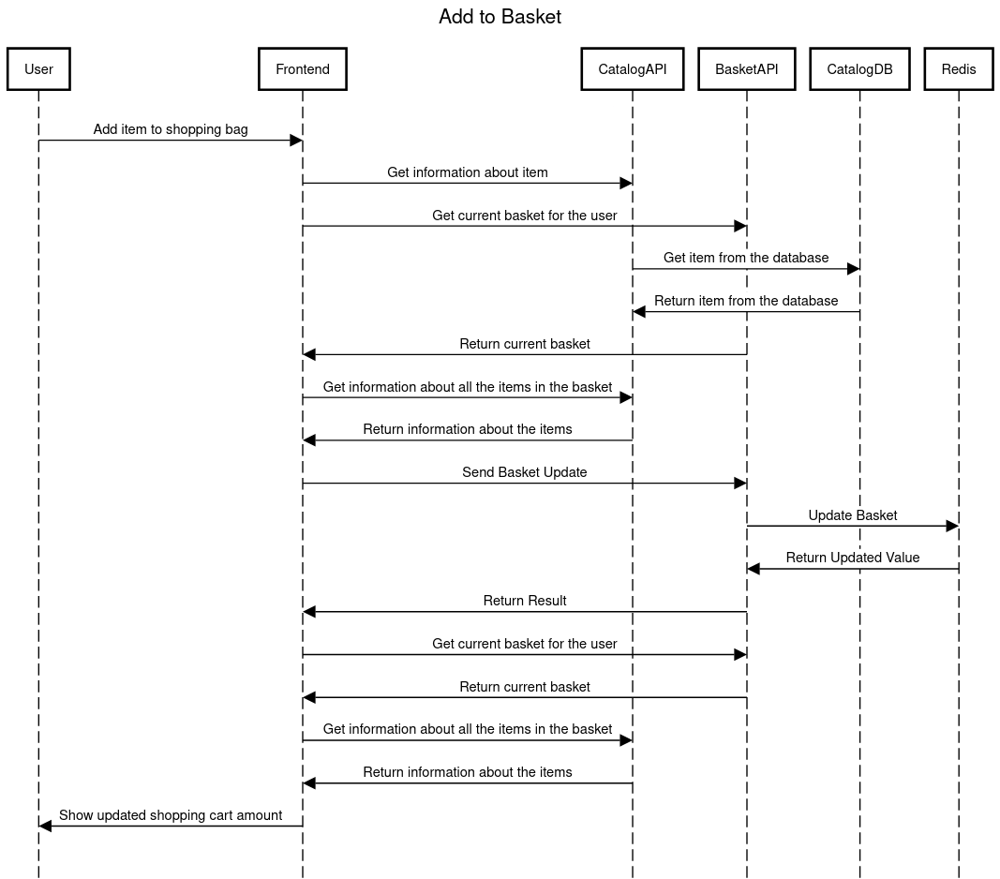

# eShop

For this project I chose to implement tracing for the **“Add to Cart”** feature.

# How to run

- Run the eshop with `dotnet run --project src/eShop.AppHost/eShop.AppHost.csproj`
- Run the collectors/exporters with `docker-compose up --build`
- Frontend can be found at `https://localhost:7298`, Grafana at `http://localhost:3000` (admin:admin), Jaeger at `http://localhost:16686` and Prometheus at `http://localhost:9090`

# Sequence Diagram

